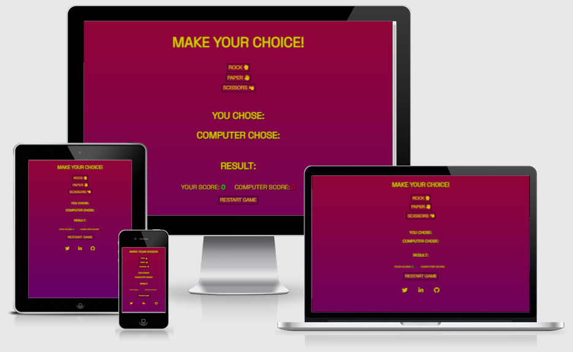
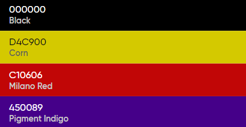
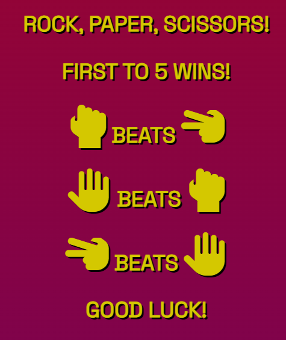
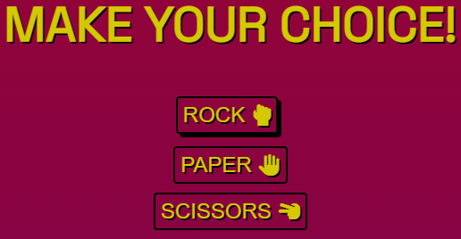
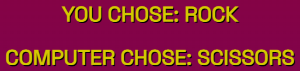
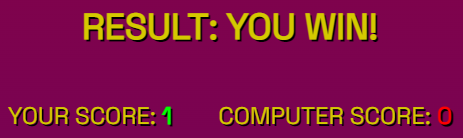

## Table of Contents

# Milestone Project 2 - Rock, Paper, Scissors Game
## Purpose
This website was created to complete the second Milestone Project for Code Insitute's Full Stack Software Developer course. I built this from the ground up using knowledge I gained from the previous modules. These being HTML, CSS, User Centric Design and JavaScript. The full list of technologies used can be found in the technologies section further down.

Users of this website are able to challenge themselves to play against a computer, with the winner being declared when either one reaches a score of 5.

You can find the link to the live website right [here](https://jrdnbrkfld.github.io/pp2-rock-paper-scissors/).

***

## User Experience Design

### User Stories
#### First Time Visitor Goals
* As a First Time user, I want to easily understand the main purpose of the site.
* As a First Time user, I want a simple but effective way of making my choices while playing the game.
* As a First Time user, I want to clearly see how my choices are affecting the game for good or bad.
* As a First Time user, I want to see the scores of the game to understand which user is winning or losing.
* As a First Time user, I want to find ways to follow the creator of the site on multiple social media platforms to keep up to date with what they have created.
#### Returning Visitor Goals
* As a Returning user, I want to be able to return to see if I can beat the computer again or for the first time.

## Design
#### Imagery
The images you are greeted to when entering the website are relating to the objective of the game. The sizes of the images vary depending on the size of the screen they are viewed on.
#### Fonts
The font used throughout the website is **Space Grotesk**. I used only 1 font for the site, but used text-transform to make all text uppercase.
#### Color Scheme
Four colors are used in this website, these being #000000, #D4C900, #450089 and #C10606. I incorporated a background gradient to mix the Milano Red and Pigment Indigo to make the site more appealing. The background and foreground colors have a sufficient contrast ratio to aid with accessibility.

*** 

## Features

### Existing Features
* #### Splash Screen
    * This section is the first thing the user is greeted with when opening the website. 
    * It clearly states the main objective of the game, the rules to follow and a supporting message.
    * The purpose of this is to fulfill the user story:
    > As a First Time user, I want to easily understand the main purpose of the site.

    

* #### Choice Area
    * This section includes a block of text encouraging the user to make a choice, and buttons corresponding to either of the 3 choices to make.
    * The buttons in this section are styled in a way that when the user hovers over (on desktop) or clicks the button (on mobile) it will apply a shadow to give a raised look.
    * I also incorporated an idle animation to the buttons that loops every 5 seconds. This gives the buttons a bouncy animation that has a small delay between each of them, so they don't all bounce at once.
    * The purpose of this is to fulfill the user story:
    > As a First Time user, I want a simple but effective way of making my choices while playing the game.

    

* #### Chosen Area
    * This section has 2 main blocks of text. These being what the user has chosen, and what the computer has chosen.
    * The computer choice is generated through a JavaScript function I created that generates a random number of 1 (rock), 2 (paper) or 3 (scissors). In this case I chose the option Rock, while the computer choice generated the number 3 resulting in Scissors. Therefore I won the round.
    * The purpose of this is to fulfill the user story:
    > As a First Time user, I want to clearly see how my choices are affecting the game for good or bad.

    

* #### Score Area
    * This section returns the result after the user and computer have made their choice.
    * I wrote a JavaScript function that increments the score by 1 each time their is a winner. It does nothing when it is a loss, or draw.
    * I changed the font color of the scores to reflect the user score and computer score.
    * The purpose of this is to fulfill the user story:
    > As a First Time user, I want to see the scores of the game to understand which user is winning or losing.

    

### Features Left to Implement

*** 

## Technologies

list all tech

***

## Testing

list all testing done here

## Validator Testing

validator tests

## Issues and Resolutions

list bugs and what was done to fix

***

## Deployment

* This website was deployed using GitHub pages. The steps to deploy are as follows:
    * In the GitHub repository, navigate to the settings tab.
    * From the source section drop-down menu, select the Main Branch.
    * After the main branch has been selected, the page provided the link to the completed website.

***

## Credits

mention all who helped